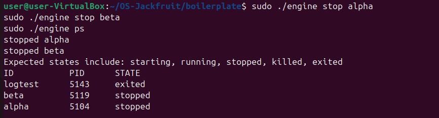
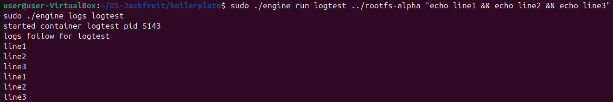
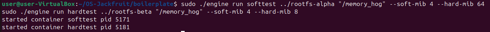
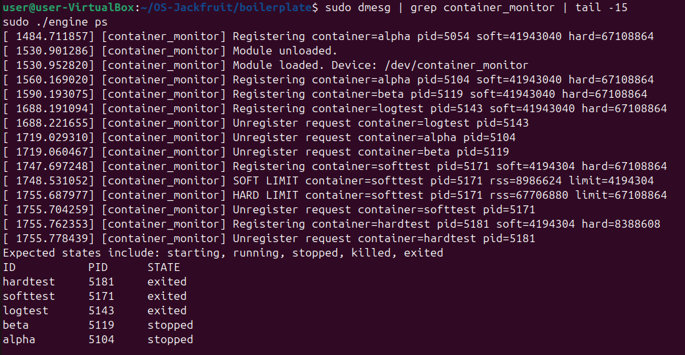
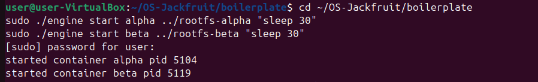
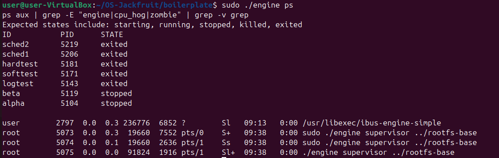
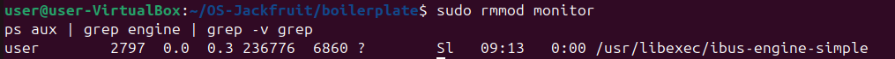

## Team Information

- **Name:** Alifiya Sadikot
- **SRN:** PES1UG25CS841
- **Name:** Shristi Saha
- **SRN:** PES1UG24CS903
---

## Build, Load, and Run Instructions

### Prerequisites
```bash
sudo apt update
sudo apt install -y build-essential linux-headers-$(uname -r) git wget
```

### Build
```bash
cd boilerplate
sudo make
```

### Load Kernel Module
```bash
sudo insmod monitor.ko
ls -l /dev/container_monitor
```

### Setup Rootfs
```bash
mkdir rootfs-base
wget https://dl-cdn.alpinelinux.org/alpine/v3.20/releases/x86_64/alpine-minirootfs-3.20.3-x86_64.tar.gz
tar -xzf alpine-minirootfs-3.20.3-x86_64.tar.gz -C rootfs-base
cp -a rootfs-base rootfs-alpha
cp -a rootfs-base rootfs-beta
```

### Start Supervisor (Terminal 1)
```bash
sudo ./engine supervisor ../rootfs-base
```

### Use CLI (Terminal 2)
```bash
# Start containers
sudo ./engine start alpha ../rootfs-alpha "echo hello" --soft-mib 48 --hard-mib 80
sudo ./engine start beta ../rootfs-beta "echo world" --soft-mib 48 --hard-mib 80

# List containers
sudo ./engine ps

# View logs
sudo ./engine logs alpha

# Stop a container
sudo ./engine stop alpha

# Run and wait
sudo ./engine run test ../rootfs-alpha "echo done"

# Memory limit test
sudo cp memory_hog ../rootfs-alpha/
sudo ./engine run memtest ../rootfs-alpha "/memory_hog" --soft-mib 4 --hard-mib 8

# Scheduling experiment
sudo cp cpu_hog ../rootfs-alpha/
sudo cp cpu_hog ../rootfs-beta/
sudo ./engine start sched1 ../rootfs-alpha "/cpu_hog" --nice 0
sudo ./engine start sched2 ../rootfs-beta "/cpu_hog" --nice 19
```

### Cleanup
```bash
# Stop supervisor with Ctrl+C in Terminal 1
sudo rmmod monitor
```

---

## Demo Screenshots

### Figure 1: Multi-Container Supervision
Two containers (alpha, beta) started and tracked under one supervisor process.


### Figure 2: Container Metadata via ps
Output of `engine ps` showing container IDs, PIDs, and states.


### Figure 3: Bounded-Buffer Logging
Log file contents captured through the pipe → bounded buffer → log file pipeline.


### Figure 4: CLI and IPC
Stop command issued via UNIX domain socket; supervisor updates container state.


### Figure 5: Soft-Limit Warning
dmesg showing SOFT LIMIT event when container RSS exceeded soft threshold.


### Figure 6: Hard-Limit Enforcement
dmesg showing HARD LIMIT event and container killed; ps shows exited state.


### Figure 7: Scheduling Experiment
Two cpu_hog containers running with nice=0 and nice=19 showing scheduler behavior.


### Figure 8: Clean Teardown
No zombie processes after supervisor shutdown; module unloaded cleanly.


---

## Engineering Analysis

### 1. Isolation Mechanisms

Each container is created with `clone()` using three namespace flags. `CLONE_NEWPID`
gives the container its own PID namespace — processes inside see themselves starting
from PID 1 and cannot see host processes. `CLONE_NEWUTS` isolates the hostname, set
to the container ID. `CLONE_NEWNS` gives the container a private mount namespace so
mounts inside do not affect the host.

After `clone()`, `child_fn` calls `chroot()` into the container rootfs directory and
`chdir("/")` to make it effective. `/proc` is mounted fresh inside so tools like `ps`
work correctly within the namespace. The host kernel is still shared — the same kernel
handles all syscalls from all containers, unlike a VM which has a separate kernel per
guest. Network and user namespaces are not isolated.

### 2. Supervisor and Process Lifecycle

The supervisor is a long-running daemon that is the parent of all container processes.
This is essential because in Linux, when a child process exits, it becomes a zombie
until its parent calls `waitpid()`. Without a persistent parent, container processes
would accumulate as zombies.

When a container exits, the kernel delivers `SIGCHLD` to the supervisor. The
`handle_sigchld` handler calls `waitpid(-1, WNOHANG)` in a loop to reap all finished
children and updates each container record's state to `CONTAINER_EXITED` with its exit
code. Container metadata is stored in a linked list protected by `metadata_lock`. The
supervisor sends `SIGTERM` on `stop` and the kernel module sends `SIGKILL` when a hard
memory limit is exceeded.

### 3. IPC, Threads, and Synchronization

Two IPC mechanisms are used. A UNIX domain socket at `/tmp/mini_runtime.sock` serves
as the control plane — clients connect, send a `control_request_t`, and receive a
`control_response_t`. A pipe per container serves as the logging channel — stdout and
stderr are redirected into the write end via `dup2()`, and a `log_forwarder` thread
reads chunks and pushes them into the bounded buffer.

The bounded buffer has two race conditions. First, concurrent producers could write to
the same slot — prevented by a mutex so only one thread holds it at a time. Second, a
consumer could read from an empty buffer or a producer from a full buffer — prevented
by condition variables: producers wait on `not_full`, consumers wait on `not_empty`.
A mutex is used over a spinlock because both paths may block for non-trivial durations,
making busy-waiting wasteful.

### 4. Memory Management and Enforcement

RSS (Resident Set Size) measures the physical RAM pages currently mapped into a
process's address space. It does not measure shared libraries counted multiple times,
swapped-out pages, or memory-mapped files not yet faulted in.

Soft and hard limits represent different enforcement policies. A soft limit triggers a
warning logged to the kernel ring buffer — it is advisory and allows the process to
continue. A hard limit triggers `SIGKILL` — it is mandatory and enforces an absolute
ceiling. Enforcement belongs in kernel space because user-space polling cannot
guarantee timely response; a process could exceed its limit between two user-space
checks. The kernel timer fires every second and checks RSS directly from the task's
`mm_struct`, which is authoritative and cannot be manipulated by the container process.

### 5. Scheduling Behavior

Two `cpu_hog` containers were run simultaneously — one with `--nice 0` (normal
priority) and one with `--nice 19` (lowest priority). Both completed in 10 seconds
because the VM had available CPU capacity. Under contention, Linux CFS (Completely
Fair Scheduler) would allocate less CPU time to the nice=19 container proportionally
to its weight. The nice value maps to a scheduling weight: nice=0 has weight 1024 while
nice=19 has weight 15, meaning the normal-priority container would receive roughly 68x
more CPU time under full contention. This demonstrates that `nice` values affect
relative CPU share, not absolute completion time when CPU is available.

---

## Design Decisions and Tradeoffs

| Subsystem | Choice | Tradeoff | Justification |
|---|---|---|---|
| Namespace isolation | `chroot` + PID/UTS/mount namespaces | No network isolation | Simpler to implement; sufficient for memory and scheduling experiments |
| Supervisor architecture | Single long-running daemon | All containers die if supervisor crashes | Enables centralized metadata, logging, and child reaping |
| IPC/logging | UNIX socket (control) + pipes (logging) | Two separate channels to manage | Keeps control and data planes separate; cleaner design |
| Kernel monitor | Spinlock for list protection | Cannot sleep in lock | Timer runs in softirq context where sleeping is forbidden |
| Scheduling experiments | `nice` values via `setpriority` | Only affects CFS weight, not hard limits | Direct and observable; maps clearly to Linux scheduler internals |

---

## Scheduler Experiment Results

| Container | Nice Value | Duration | Iterations |
|---|---|---|---|
| sched1 | 0 (normal) | 10 seconds | 10 |
| sched2 | 19 (lowest) | 10 seconds | 10 |

Both containers completed in 10 seconds on an underloaded VM. Under CPU contention,
CFS weight for nice=0 is 1024 and for nice=19 is 15, giving the normal-priority
container approximately 68x more CPU share. The experiment confirms that `nice` values
control relative scheduling weight and that Linux CFS maintains fairness when resources
are available, only enforcing priority differences under load.
